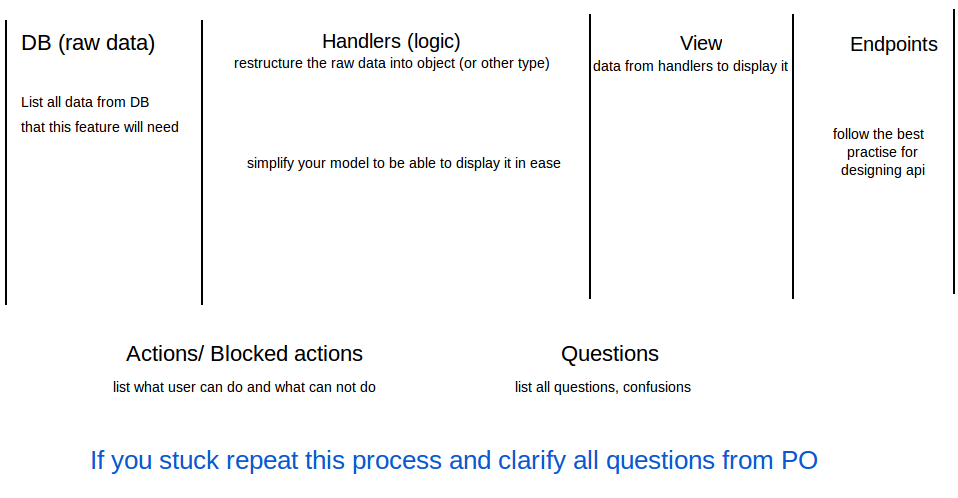

# process-checklist
From idea to implementation

### The following steps are for one feature at a time

1. Do basic wireframes based on your PO (product owner) requirements.
2. Determine user actions, blocked actions (what user can not do) and write all possible questions you may have.
3. Based on actions determine what data do you need.
4. Determine (list) all endpoints which allow the actions.
5. From point 3 list the raw data structure from DB

### On whiteboard or paper create few columns and visualise the above steps

